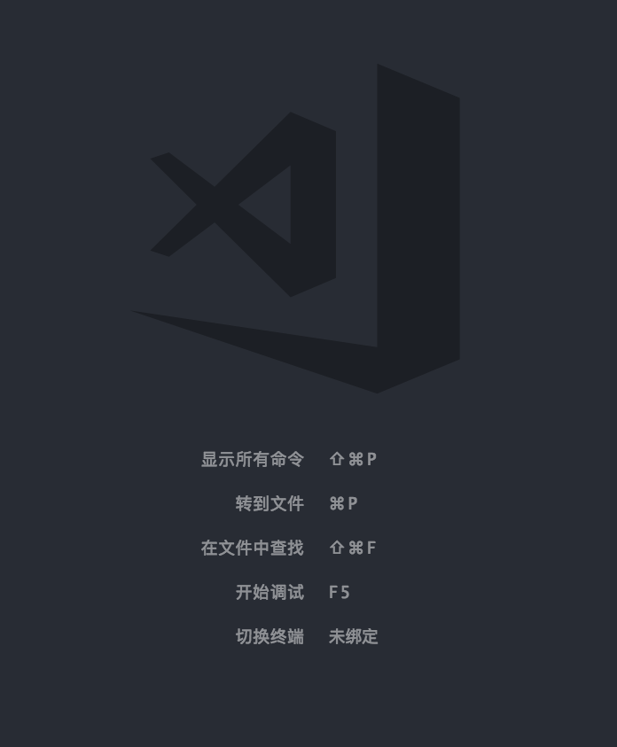

# vscode 使用技巧

在 vscode 的初始界面上，其实就已经写上了最关键的几个命令的快捷键。

下面就对这几个快捷键做深入的说明。



## 显示所有命令

快捷键：`command + shift + P`

操作步骤：打开一个命令行，输入关键字搜索相关命令，回车执行命令

## 转到文件

快捷键：`command + P`

操作步骤：打开一个命令行，输入文件名，选择相应文件，vscode 将会打开文件

## 万能的 command + P

快捷键：`command + P`

操作步骤：打开一个命令行，输入文件名，选择相应文件，vscode 将会打开文件

提示：打开命令行后，输入 `?` 有相关功能的提示

功能列表：

| 键入关键字 | 功能说明 |
| -------- | ------- |
| 无关键字 | 根据输入匹配当前项目的文件名，打开文件 |
| : | 跳转到当前文件某一行，后面加要跳转的行数 |
| @ | 跳转到当前文件中某‘符号’的位置 (’符号‘可以是 html 标签，css 类名，js 函数名，等) |
| > | 显示并运行命令，同 `command + shift + P` |
| debug | 运行 debug 中设置好的某个配置 |
| task | 运行任务 (任务可以从 package.json 中读取 scripts 内容) |
| ? | 获取有关可进行的操作的帮助 |

注意：因为英文关键字与无关键字功能重复，所以<b>英文关键字后都需要加一个空格</b>才能生效！！！（例如：debug, task, 等）

以上只是其中一部分常用功能，如果想了解更多，使用 `?` 查看

## 在文件中查找

快捷键：`command + shift + F`

操作步骤：打开搜索框，输入关键字搜索相关内容

## vscode 调试功能

快捷键：`F5`

操作步骤：直接开始调试

## 打开终端

快捷键：`ctrl + ~`

操作步骤：直接打开

## 添加 jsdoc 注释

操作步骤：在 js 或 vue 文件中 -> 输入 `/**` -> 按回车键即可添加 jsdoc 注释行

## vscode 类型检查

说明：VS Code 允许您在常规 JavaScript 文件中利用 TypeScript 的一些高级类型检查和错误报告功能，这是捕捉常见编程错误的好方法。

功能：这些类型检查还启用了一些令人兴奋的JavaScript快速修复，包括添加缺少导入和添加缺少属性。


## vscode 搜索功能

## vscode git 功能

## vscode 推荐配置

编辑器本身配置：

```json
{
  "editor.tabSize": 2, // 一个 tab 等于 2 个空格
  "editor.fontSize": 12,
  "editor.lineHeight": 25,
  "editor.insertSpaces": true, // 按 tab 等于插入空格
  "editor.renderWhitespace": "all", // 显示隐藏字符
  "editor.wordWrap": "on",
  "editor.formatOnSave": true
}
```

插件配置：

```json
{
  "path-intellisense.mappings": {
    "@": "${workspaceRoot}/src",
    "~@": "${workspaceRoot}/src"
  },
  "eslint.autoFixOnSave": true,
  "eslint.validate": [
    "javascript",
    "javascriptreact",
    "html",
    {
      "language": "vue",
      "autoFix": true
    },
    {
      "language": "typescript",
      "autoFix": true
    }
  ],
  "vetur.format.defaultFormatter.js": "none",
  "vetur.validation.script": false,
  "vetur.validation.template": false,
  "beautify.tabSize": 2,
  "beautify.options": {
    "end_with_newline": true
  },
  "projectManager.groupList": true,
  "gitlens.advanced.messages": {
    "suppressResultsExplorerNotice": true,
    "suppressShowKeyBindingsNotice": true,
    "suppressUpdateNotice": true
  },
  "auto-rename-tag.activationOnLanguage": [
    "html",
    "vue",
    "javascript",
    "javascriptreact"
  ],
  "languageStylus.useSeparator": false,
  "todohighlight.exclude": [
    "**/node_modules/**",
    "**/bower_components/**",
    "**/dist/**",
    "**/build/**",
    "**/.vscode/**",
    "**/.github/**",
    "**/_output/**",
    "**/*.min.*",
    "**/*.map",
    "**/.next/**",
    "**/lib/**"
  ],
  "todohighlight.isEnable": true,
  "todohighlight.include": [
    "**/*.js",
    "**/*.jsx",
    "**/*.ts",
    "**/*.tsx",
    "**/*.html",
    "**/*.php",
    "**/*.css",
    "**/*.scss",
    "**/*.vue"
  ]
}
```

## 相关链接

[vscode 插件](./vscode-plugins.html)